# Gitter UML Class Diagram

This document provides a comprehensive UML class diagram of the Gitter project architecture, showing all classes, their relationships, and design patterns.

## Complete Class Diagram

```mermaid
classDiagram
    %% ============================================
    %% CLI Layer - Command Pattern
    %% ============================================
    
    class ICommand {
        <<interface>>
        +execute(ctx, args) Expected~void~
        +name() const char*
        +description() const char*
        +helpNameLine() const char*
        +helpSynopsis() const char*
        +helpDescription() const char*
        +helpOptions() vector~pair~
    }
    
    class CommandFactory {
        <<singleton>>
        -creators map~string, Creator~
        +instance() CommandFactory&
        +registerCreator(name, creator) void
        +create(name) unique_ptr~ICommand~
        +listCommands(out) void
    }
    
    class CommandInvoker {
        +invoke(cmd, ctx, args) Expected~void~
    }
    
    class HelpCommand {
        +execute(ctx, args) Expected~void~
        +name() const char*
        +description() const char*
    }
    
    class InitCommand {
        +execute(ctx, args) Expected~void~
        +name() const char*
        +description() const char*
    }
    
    class AddCommand {
        +execute(ctx, args) Expected~void~
        +name() const char*
        +description() const char*
    }
    
    class CommitCommand {
        +execute(ctx, args) Expected~void~
        +name() const char*
        +description() const char~
    }
    
    class StatusCommand {
        +execute(ctx, args) Expected~void~
        +name() const char*
        +description() const char*
    }
    
    class LogCommand {
        +execute(ctx, args) Expected~void~
        +name() const char*
        +description() const char*
    }
    
    class CheckoutCommand {
        +execute(ctx, args) Expected~void~
        +name() const char*
        +description() const char*
    }
    
    class ResetCommand {
        +execute(ctx, args) Expected~void~
        +name() const char*
        +description() const char*
    }
    
    class RestoreCommand {
        +execute(ctx, args) Expected~void~
        +name() const char*
        +description() const char*
    }
    
    class CatFileCommand {
        +execute(ctx, args) Expected~void~
        +name() const char*
        +description() const char*
    }
    
    %% ============================================
    %% Core Layer - Domain Logic
    %% ============================================
    
    class Repository {
        <<singleton>>
        +instance() Repository&
        +init(path) Expected~void~
        +discoverRoot(start) Expected~path~
        +resolveHEAD(root)$ Expected~pair~
        +updateHEAD(root, hash)$ Expected~void~
        +branchExists(root, name)$ Expected~bool~
        +listBranches(root)$ Expected~vector~
        +getCurrentBranch(root)$ Expected~string~
        +createBranch(root, name, hash)$ Expected~void~
        +switchToBranch(root, name)$ Expected~void~
        +getBranchCommit(root, name)$ Expected~string~
    }
    
    class ObjectStore {
        -root path
        -hasher unique_ptr~IHasher~
        +ObjectStore(root, hasher)
        +objectsDir() path
        +writeBlob(bytes) string
        +writeTree(content) string
        +writeCommit(content) string
        +writeBlobFromFile(filePath) string
        +hashFileContent(filePath) string
        +readObject(hash) string
        +readBlob(hash) string
        +readCommit(hash) CommitObject
        +readTree(hash) vector~TreeEntry~
        +getObjectPath(hash) path
    }
    
    class Index {
        -pathToEntry map~string, IndexEntry~
        +load(repoRoot) bool
        +save(repoRoot) bool
        +addOrUpdate(entry) void
        +remove(path) void
        +clear() void
        +entries() const map~string, IndexEntry~&
        +entriesMut() map~string, IndexEntry~&
    }
    
    class IndexEntry {
        +path string
        +hashHex string
        +sizeBytes uint64_t
        +mtimeNs uint64_t
        +mode uint32_t
        +ctimeNs uint64_t
    }
    
    class TreeBuilder {
        +buildFromIndex(index, store)$ string
        -buildTree(dirPath, entries, store)$ string
        -getDirectChildren(dirPath, entries, store)$ vector~TreeEntry~
    }
    
    class TreeEntry {
        +mode uint32_t
        +name string
        +hashHex string
        +isTree bool
    }
    
    class CommitObject {
        +hash string
        +treeHash string
        +parentHashes vector~string~
        +authorName string
        +authorEmail string
        +authorTimestamp int64_t
        +authorTimezone string
        +committerName string
        +committerEmail string
        +committerTimestamp int64_t
        +committerTimezone string
        +message string
        +shortMessage() string
        +shortHash() string
    }
    
    class AppContext {
        <<struct>>
    }
    
    %% ============================================
    %% Util Layer - Infrastructure
    %% ============================================
    
    class IHasher {
        <<interface>>
        +reset() void
        +update(data, len) void
        +update(string) void
        +digest() vector~uint8_t~
        +name() const char*
        +digestSize() size_t
        +toHex(bytes)$ string
    }
    
    class Sha1Hasher {
        +reset() void
        +update(data, len) void
        +update(string) void
        +digest() vector~uint8_t~
        +name() const char*
        +digestSize() size_t
    }
    
    class Sha256Hasher {
        +reset() void
        +update(data, len) void
        +update(string) void
        +digest() vector~uint8_t~
        +name() const char*
        +digestSize() size_t
    }
    
    class HasherFactory {
        +createDefault() unique_ptr~IHasher~
        +create(algorithm) unique_ptr~IHasher~
    }
    
    class PatternMatcher {
        <<namespace>>
        +globToRegex(pattern) regex
        +isPattern(path) bool
        +matchFilesInWorkingTree(pattern, root, gitterDir) vector~path~
        +matchPathsInIndex(pattern, indexPaths) vector~string~
    }
    
    class Logger {
        <<singleton>>
        -currentLevel LogLevel
        +instance() Logger&
        +setLevel(level) void
        +level() LogLevel
        +error(msg) void
        +warn(msg) void
        +info(msg) void
        +debug(msg) void
    }
    
    class LogLevel {
        <<enumeration>>
        Error
        Warn
        Info
        Debug
    }
    
    class Expected~T~ {
        <<template>>
        -hasValue bool
        -value_ T
        -error_ Error
        +has_value() bool
        +value() T&
        +error() Error&
    }
    
    class Expected~void~ {
        -ok bool
        -error_ Error
        +has_value() bool
        +error() Error&
    }
    
    class Error {
        <<struct>>
        +code ErrorCode
        +message string
    }
    
    class ErrorCode {
        <<enumeration>>
        None
        InvalidArgs
        NotARepository
        AlreadyInitialized
        IoError
        CorruptObject
        RefNotFound
        EmptyIndex
        InternalError
    }
    
    %% ============================================
    %% Relationships
    %% ============================================
    
    %% CLI Layer Relationships
    ICommand <|.. HelpCommand : implements
    ICommand <|.. InitCommand : implements
    ICommand <|.. AddCommand : implements
    ICommand <|.. CommitCommand : implements
    ICommand <|.. StatusCommand : implements
    ICommand <|.. LogCommand : implements
    ICommand <|.. CheckoutCommand : implements
    ICommand <|.. ResetCommand : implements
    ICommand <|.. RestoreCommand : implements
    ICommand <|.. CatFileCommand : implements
    
    CommandFactory ..> ICommand : creates
    CommandInvoker ..> ICommand : uses
    
    %% Commands use Core Layer
    InitCommand ..> Repository : uses
    AddCommand ..> Repository : uses
    AddCommand ..> Index : uses
    AddCommand ..> ObjectStore : uses
    AddCommand ..> PatternMatcher : uses
    CommitCommand ..> Repository : uses
    CommitCommand ..> Index : uses
    CommitCommand ..> ObjectStore : uses
    CommitCommand ..> TreeBuilder : uses
    StatusCommand ..> Repository : uses
    StatusCommand ..> Index : uses
    StatusCommand ..> ObjectStore : uses
    LogCommand ..> Repository : uses
    LogCommand ..> ObjectStore : uses
    CheckoutCommand ..> Repository : uses
    CheckoutCommand ..> Index : uses
    CheckoutCommand ..> ObjectStore : uses
    ResetCommand ..> Repository : uses
    ResetCommand ..> Index : uses
    RestoreCommand ..> Repository : uses
    RestoreCommand ..> Index : uses
    RestoreCommand ..> PatternMatcher : uses
    CatFileCommand ..> Repository : uses
    CatFileCommand ..> ObjectStore : uses
    
    %% Core Layer Relationships
    Index "1" *-- "many" IndexEntry : contains
    TreeBuilder ..> Index : uses
    TreeBuilder ..> ObjectStore : uses
    TreeBuilder "1" *-- "many" TreeEntry : creates
    ObjectStore ..> IHasher : uses
    ObjectStore ..> CommitObject : returns
    ObjectStore ..> TreeEntry : returns
    Repository ..> Index : manages
    Repository ..> ObjectStore : manages
    
    %% Util Layer Relationships
    IHasher <|.. Sha1Hasher : implements
    IHasher <|.. Sha256Hasher : implements
    HasherFactory ..> IHasher : creates
    ObjectStore ..> HasherFactory : uses
    
    %% Error Handling
    ICommand ..> Expected~void~ : returns
    Repository ..> Expected~void~ : returns
    Repository ..> Expected~string~ : returns
    Repository ..> Expected~path~ : returns
    Repository ..> Expected~bool~ : returns
    Repository ..> Expected~pair~ : returns
    Repository ..> Expected~vector~ : returns
    
    %% Logging
    Logger ..> LogLevel : uses
    CommandInvoker ..> Logger : uses
```



## Design Patterns Illustrated

### 1. **Command Pattern**
- `ICommand` interface defines the contract
- All command classes (`AddCommand`, `CommitCommand`, etc.) implement `ICommand`
- `CommandFactory` creates commands dynamically
- `CommandInvoker` executes commands uniformly

### 2. **Factory Pattern**
- `CommandFactory` creates command instances from string names
- `HasherFactory` creates hasher instances (SHA-1/SHA-256)

### 3. **Singleton Pattern**
- `Repository` - Single global instance for repository state
- `CommandFactory` - Single factory instance
- `Logger` - Single logging instance

### 4. **Strategy Pattern**
- `IHasher` interface with `Sha1Hasher` and `Sha256Hasher` implementations
- `ObjectStore` uses `IHasher` without knowing concrete implementation

### 5. **Facade Pattern**
- `Repository` provides simplified interface to complex Git operations
- Hides complexity of HEAD management, branch operations, etc.

## Layer Dependencies

```
┌─────────────────────────────────────────┐
│          CLI Layer (Commands)            │
│  ┌───────────────────────────────────┐  │
│  │  Commands depend on Core Layer   │  │
│  └───────────────────────────────────┘  │
└────────────────┬────────────────────────┘
                 │
                 ▼
┌─────────────────────────────────────────┐
│         Core Layer (Domain Logic)       │
│  ┌───────────────────────────────────┐  │
│  │  Core depends on Util Layer      │  │
│  └───────────────────────────────────┘  │
└────────────────┬────────────────────────┘
                 │
                 ▼
┌─────────────────────────────────────────┐
│      Util Layer (Infrastructure)        │
│  (No dependencies on upper layers)      │
└─────────────────────────────────────────┘
```

## Key Relationships

### Commands → Core Layer
- Commands use `Repository` for repo operations
- Commands use `Index` for staging area management
- Commands use `ObjectStore` for Git object storage
- Commands use `TreeBuilder` for building commit trees

### Core Layer → Util Layer
- `ObjectStore` uses `IHasher` for content hashing
- Commands use `PatternMatcher` for glob pattern matching
- All layers use `Logger` for logging
- All layers use `Expected<T>` for error handling

### Core Layer Internal
- `TreeBuilder` uses `Index` to read staged files
- `TreeBuilder` uses `ObjectStore` to write tree objects
- `ObjectStore` stores `CommitObject` and `TreeEntry` structures
- `Index` contains multiple `IndexEntry` objects

## Notes

1. **Singleton Pattern**: `Repository`, `CommandFactory`, and `Logger` use singleton pattern to ensure single global instance.

2. **Error Handling**: All operations that can fail return `Expected<T>` instead of throwing exceptions, providing type-safe error handling.

3. **Template Specialization**: `Expected<void>` is specialized for operations that don't return values.

4. **Strategy Pattern**: Hash algorithms are pluggable via `IHasher` interface, allowing runtime selection of SHA-1 or SHA-256.

5. **Dependency Direction**: Dependencies flow downward only (CLI → Core → Util), maintaining clean layer separation.

## Related Documentation

- [Architecture Overview](ARCHITECTURE.md) - Detailed architecture documentation
- [Hasher Design](HASHER_DESIGN.md) - Strategy pattern for hashing algorithms
- [Tree Storage](TREE_STORAGE.md) - How directory trees are stored
- [Main README](../README.md) - Project overview and quick start

